# Boundary Estimator and Controller Design for Micro Beams
A schematic of the cantilever beam used in M/NEMS devices is shown in the Fig. 1. The cantilever has length $L$, uniform cross section $A$, and width $b$; it is separated by a gap with length $g$ from the underneath substrate. The substrate exposes the beam to nonlinear distributed forces arising from electrical potential difference and intermolecular interactions between the beam and the underneath substrate.
 
<p align="center">

</p>


#### Fig. 1. Schematic of a cantilever beam based M/NEMS device: (a) Cantilever beam, (b) Dielectric spacer, and (c) Substrate.

Based on the strain gradient elasticity theory by Lam et al., a new flexible micro beam model can be derived by making Euler-Bernoulli beam assumptions and by using Hamilton principle. Accordingly, the governing PDE of motion and corresponding boundary conditions (BSc) for a micro cantilever beam with uniform cross section $A$ and length $L$ become

$${K_1}\frac{{{\partial ^4}w}}{{\partial {x^4}}} - {K_2}\frac{{{\partial ^6}w}}{{\partial {x^6}}} + \rho A\frac{{{\partial ^2}w}}{{\partial {t^2}}} = f(x,t),$$

$$\left\{ \begin{array}{l}
w\left( {0,t} \right) = \frac{{\partial w}}{{\partial x}}(0,t) = \frac{{{\partial ^2}w}}{{\partial {x^2}}}(0,t) = 0,\\
{K_2}\frac{{{\partial ^5}w}}{{\partial {x^5}}}(L,t) - {K_1}\frac{{{\partial ^3}w}}{{\partial {x^3}}}(L,t) = F,\,\,\,\,\,\,\,\,\,\,\,\\
{K_1}\frac{{{\partial ^2}w}}{{\partial {x^2}}}(L,t) - {K_2}\frac{{{\partial ^4}w}}{{\partial {x^4}}}(L,t) = {M^c},\,\,\,\,\,\,\\
{K_2}\frac{{{\partial ^3}w}}{{\partial {x^3}}}(L,t) = {M^{nc}},\,\,\,\,\,\,\,\,\,\,\,\,\,\,\,\,\,\,
\end{array} \right.$$


where $x$ and $t$ denote the independent spatial and time variables, respectively; $\rho$ represents the beam density; $w$ indicates the lateral deflection; $f(x,t)$ denotes distributed external transverse force; $F$, $M^c$ and $M^{nc}$ are control inputs and refer to boundary force, moment and non-classical moment exerted at the tip of beam, respectively.  In addition,

\begin{array}{l}
{K_1} = EI + \mu A\left( {2l_0^2 + \frac{8}{{15}}l_1^2 + l_2^2} \right),\\
{K_2} = \mu I\left( {2l_0^2 + \frac{4}{5}l_1^2} \right),
\end{array}


where $I$ is the area moment of inertia of the beam cross-section; $\mu$ and $E$ are the shear and Young’s modulus, respectively; $\ell_0$,  $\ell_1$, and $\ell_2$ are additional material constants that appear in the constitutive relations between higher order stress tensors and strain tensors in strain gradient elasticity theory. By setting $\ell_0$, $\ell_1$, and $\ell_2$ to zero, the classical Euler-Bernoulli beam model can be obtained straightforwardly. 


### External Distributed Forces
The intermolecular forces that play a crucial role in micron and submicron scale are the van der Waals and the Casimir force, which have different range of application. The Casimir force is effective in the micro-scale ranges whereas the van der Waals force is effective in nano-scale ranges. To investigate a general case, we omit consideration of the transition regime and formulate the distributed external transverse forces more generally as follows:
  
$$f(x,t) = f(w) = \frac{{{\varepsilon _0}b{V^2}}}{{2{{(g - w)}^2}}}(1 + 0.65\frac{{g - w}}{b}) + \frac{{{\pi ^2}\hbar cb}}{{240{{(g - w)}^4}}} + \frac{{Ab}}{{6\pi {{(g - w)}^3}}},$$


in which the first right-hand side term gives the value of the electrostatic force with first order fringing field correction; the next one gives the value of the Casimir force; the last one is the usual expression for the van der Waals force. Furthermore, $\hbar = 1.055\times 10^{-43}Js$ is Plank constant divided by $2\pi$; $c=2.2998\times 10^8 m/s$ is speed of light; $\epsilon_0=8.854\times 10^{-12}C^2/Nm^2$ is the permittivity of vacuum;  $A$ is the Hamaker constant with values in the range of $[0.4,4]\times 10^{-19}J$ and $V$ denotes the electrical potential difference between the beam and the underneath plate. Utilizing the strain gradient Euler-Bernoulli beam model and defining the following dimensionless variables:$\alpha$


$$\alpha  = \frac{{{\pi ^2}\hbar cb{L^4}}}{{240{g^5}{K_1}}}\,,\,\,\,\mu  = \frac{{Ab{L^4}}}{{6\pi {g^4}{K_1}}},\,\,\,\beta  = \frac{{{\varepsilon _0}b{V^2}{L^4}}}{{2{g^3}{K_1}}}\,,\,\,\,\gamma  = 0.65\frac{g}{b}\,,\,\,\,Z(\tilde x,\tilde t) = 1 - \frac{{w(\tilde x,\tilde t)}}{g},$$


the PDE and corresponding BCs governing the micro- or nano- cantilever beam used in M/NEMS devices are

$$\left\{ \begin{array}{l}
\frac{{{\partial ^4}Z}}{{\partial {{\tilde x}^4}}} - \zeta \frac{{{\partial ^6}Z}}{{\partial {{\tilde x}^6}}} + \frac{{{\partial ^2}Z}}{{\partial {{\tilde t}^2}}} + \frac{\alpha }{{{Z^4}}} + \frac{\mu }{{{Z^3}}} + \frac{\beta }{{{Z^2}}} + \frac{{\gamma \beta }}{Z} = 0.\\
Z\left( {0,\tilde t} \right) = 1,\,\,\frac{{\partial Z}}{{\partial \tilde x}}\left( {0,\tilde t} \right) = \frac{{{\partial ^2}Z}}{{\partial {{\tilde x}^2}}}\left( {0,\tilde t} \right) = 0,\\
g\frac{{{\partial ^3}Z}}{{\partial {{\tilde x}^3}}}\left( {1,\tilde t} \right) - \zeta g\frac{{{\partial ^5}Z}}{{\partial {{\tilde x}^5}}}\left( {1,\tilde t} \right) = \tilde F,\\
\zeta g\frac{{{\partial ^4}Z}}{{\partial {{\tilde x}^4}}}\left( {1,\tilde t} \right) - g\frac{{{\partial ^2}Z}}{{\partial {{\tilde x}^2}}}\left( {1,\tilde t} \right) = {{\tilde M}^c},\\
 - \zeta g\frac{{{\partial ^3}Z}}{{\partial {{\tilde x}^3}}}\left( {1,\tilde t} \right) = {{\tilde M}^{nc}}.
\end{array} \right.$$

 


## Programming
Programmings are carried out in MATLAB. The main code is `sg.m` that computes the dynamic deflection of the beam using finite-element method.

```matlab
%% sg.m
clear all
clc
fig=1
hp=1.055*10^-34;
c=2.2998*10^8;
e0=8.854*10^-12;
l = 17.6e-6;
h = 5*l;
w=10*l;
L=50*h
g=w;
V=2;
E = 1.44e9;
nu=0.38;
mu=E/(2*(1+nu));
rho = 1000;
A = w*h;
II = 1/12*w*h^3;
l0=l;
l1=l;
l2=l;
D1=E*II+mu*A*(2*l0^2+(8/15)*l1^2+l2^2);
D2=mu*II*(2*l0^2+(4/5)*l1^2);
%% %%%%%%% parameter %%%%%%%%%
% alpha=pi^2*hp*c*w*L^4/(240*g^5*D1)
% beta=e0*w*V^2*L^4/(2*g^3*D1)*10^5
% gama=0.65*g/w
% zeta=D2/D1/L^2
alpha=0.1
beta=0
gama=0
mu=0
zeta=0
kf=-1
km=0
nr=10
smax=100
dt=10^-4
n=3
Le = 1/n;
%% %%%%%%%%%%%%%%%%%%%%%%%%%%%%%%%%%%%%%%%%%%%%%
K1=(1/Le^3)*[120/7 60*Le/7 (3*Le^2)/7 -120/7 60*Le/7 -3*Le^2/7
    60*Le/7 192*Le^2/35 11*Le^3/35 -60*Le/7 108*Le^2/35 -4*Le^3/35
    (3*Le^2)/7 11*Le^3/35 (3*Le^4)/35 -(3*Le^2)/7 (4*Le^3)/35 Le^4/70
    -120/7 -60*Le/7 -(3*Le^2)/7 120/7 -60*Le/7 (3*Le^2)/7
    60*Le/7 108*Le^2/35 (4*Le^3)/35 -60*Le/7 (192*Le^2)/35 (-11*Le^3)/35
    -3*Le^2/7 -4*Le^3/35 Le^4/70 (3*Le^2)/7 (-11*Le^3)/35 (3*Le^4)/35];

K2=(zeta/(Le^5))*[720, 360*Le, 60*Le^2, -720, 360*Le, -60*Le^2
    360*Le, 192*Le^2, 36*Le^3, -360*Le, 168*Le^2, -24*Le^3
    60*Le^2, 36*Le^3, 9*Le^4, -60*Le^2, 24*Le^3, -3*Le^4
    -720, -360*Le, -60*Le^2, 720, -360*Le, 60*Le^2
    360*Le, 168*Le^2, 24*Le^3, -360*Le, 192*Le^2, -36*Le^3
    -60*Le^2, -24*Le^3, -3*Le^4,  60*Le^2, -36*Le^3, 9*Le^4];


K=K1+K2;
%% %%%%%%%%%%%%%%%%%%%%%%%%%%%%%%%%%
M = Le/55440*[21720 3732*Le 281*Le^2 6000 -1812*Le 181*Le^2
    3732*Le 832*Le^2 69*Le^3 1812*Le -532*Le^2 52*Le^3
    281*Le^2 69*Le^3 6*Le^4 181*Le^2 -52*Le^3 5*Le^4
    6000 1812*Le 181*Le^2 21720 -3732*Le 281*Le^2
    -1812*Le -532*Le^2 -52*Le^3 -3732*Le 832*Le^2 -69*Le^3
    181*Le^2 52*Le^3 5*Le^4 281*Le^2 -69*Le^3 6*Le^4];
%% %%%%%%%%%%%%%%%%%%%%%%%%%%%%%%%%%
q1=.5*dt;
q2=(1-.5)*dt;
q3=1/(4/5)/dt^2;
q4=q3*dt;
q5=1/(8/5)-1;
q6=.5/(4/5*dt);
q7=.5/(4/5);
q8=dt*(.5/(8/5)-1);
%% %%%%%%%%%%%%%%%%%%%%%%%%%%%%%%
H{1}=[-6 15 -10 0 0 1];
H{2}=Le*[-3 8 -6 0 1 0];
H{3}=0.5*Le^2*[-1 3 -3 1 0 0];
H{4}=[6 -15 10 0 0 0];
H{5}=Le*[-3 7 -4 0 0 0];
H{6}=0.5*Le^2*[1 -2 1 0 0 0];
%% %%%%%%%%%%%%%  initial cond.   %%%%%%%%%%%%%%%%%%%%%%%%
a{1,nr}=[];
ic=[1 0 0]';
for ff=1:n+1
    a{1,nr}=[ic;a{1,nr}];
end
%%% means that :   a{1,nr}=[1,0,0,1,0,0,.....]';
at{1}=zeros(3*(n+1),1);
%% %%%%%%%%%%%%%%%%%%  assembly  %%%%%%%%%%%%%%%%%%%%%%%%%%%%%%%%%%%
KG=0;
MG=0;
for qq=1:n
    KK(:,:,qq)=zeros((n+1)*3);
    MM(:,:,qq)=zeros((n+1)*3);
 
 for i=1:6
     for j=1:6
         KK(i+(qq-1)*3,j+(qq-1)*3,qq)=K(i,j);
         MM(i+(qq-1)*3,j+(qq-1)*3,qq)=M(i,j);
              
     end
 end

 KG=KG+KK(:,:,qq);
 MG=MG+MM(:,:,qq);
 
end
F1=-KG(:,1);
%% %%%%%%%%%%%%%%%%%%%%% initial force & acceleration  %%%%%%%%%%%%%%%%%%%%%%%%%%%%%%%%%%%
F0=zeros((n+1)*3,1);
for qq=1:n
  F0(1+(qq-1)*3:6+(qq-1)*3,1)=F0(1+(qq-1)*3:6+(qq-1)*3,1)+integralhandle(a{1,nr}(1+(qq-1)*3:6+(qq-1)*3)',alpha,mu,beta,gama,Le,1000);
end
att{1}=[0;0;0;MG(4:3*(n+1),4:3*(n+1))\(-F0(4:3*(n+1)))];
.
.
.
.  Please see the files for the rest
.
.
.
```

This script uses two functions `force.m` and `tanforce.m`. These functions calculate the non-linearity and the gradient of the non-linearity, respectively. The functions are generated using **MATLAB Symbolic ToolBox** and `MatlabFunction()` both incorporated in `force_generator.m` and `tanforce_generator.m`.

```matlab
%% force_generator.m
clear all
clc
syms s a1 a2 a3 a4 a5 a6 alpha beta gama mu Le

H(1,1) = 1-10*s^3+15*s^4-6*s^5;
H(2,1) = Le*(s-6*s^3+8*s^4-3*s^5);
H(3,1) = Le^2/2*(s^2-3*s^3+3*s^4-s^5);
H(4,1) = 10*s^3-15*s^4+6*s^5;
H(5,1) = Le*(-4*s^3+7*s^4-3*s^5);
H(6,1) = Le^2/2*(s^3-2*s^4+s^5);

a=[a1 a2 a3 a4 a5 a6];

Fsym=(alpha/(a*H)^4+mu/(a*H)^3+beta/(a*H)^2+beta*gama/(a*H))*H;
F=matlabFunction(Fsym,'file','force','vars',{a,s,alpha,mu,beta,gama,Le}); 
```

##	Simulation Results
Several control and estimation strategies are proposed in my papers [1,2,3]. In this section, the effectiveness of the proposed strategies in suppressing the nonlinear forced vibrations and dynamic pull-in instability of the system is demonstrated. In this regard, the nonlinear dimensionless PDE and corresponding BCs. in (2.9) under the boundary feedback control law (3.9) are numerically solved using Kantorovich method and iterative Newton-Raphson algorithm. Nonlinear terms in the governing PDE arise from external distributed forces, namely Casimir, van der Waals forces, and electrostatic force with first order fringing field correction; coefficients $\alpha$, $\mu$, $\beta$ and $\gamma$ are associated with these forces, respectively.

The geometrical and mechanical properties of the strain gradient micro-beam considered for computer simulations are specified in Table 1. The micro-beam is considered to be made of epoxy; the mechanical properties of the epoxy micro-beams are measured by Lam et al.

#### Table 1. The geometrical and mechanical properties of the epoxy micro-beam.

|Symbol	|Quantity	|Value|
|:------:|:---------:|:------:|
|$E$	|Modulus of Elasticity|	1.44 Gpa|
|$\nu$	|Poisson's Ratio|	0.38|
|$\mu$|	Density	|1220 Kg/m3|
|$\ell_0= \ell_1=\ell_2$|	Material Length Scale|	17.6 $µm$|
|$b$	|Width	|20 $µm$|
|$t$	|Thickness|	2 $µm$|
|$L$	|Length	|400 $µm$|
|$g$	|Gap Length|	4 $µm$|

According to Table 1, the coefficients corresponding to the sixth order derivative of the beam deflection, fringing fields correction term, Casimir and van der Waals forces are $\zeta=1.65\time 10^{-6}$, $\gamma = 0.13$, $\alpha = 2.18\times 10^{-8}$, and $\mu = 1.86\times 10^{-6}$, respectively. In addition, for an electric potential difference $V=20volt$, the electrostatic force coefficient is $\beta=0.63$. In this paper, all of these coefficients are also changed within specific ranges and then the static and dynamic behavior of M/NEMS devices in the absence and presence of the controller are observed. To this end, the spatial domain is discretized; the micro-beam length is divided into 10 beam elements with equal lengths. In addition, in each time step, 20 iterations are considered in the Newton-Raphson iteration method for converging to an exact solution. It is well-known that when the amount of nonlinear force coefficients become greater than specified limits, the cantilever beam becomes unstable and impulsively collapses or pulls-in onto the ground plane. Thus, in order to investigate the nonlinear vibration isolation of the closed-loop system, the threshold value of the nonlinear force coefficients should be calculated at the outset. For this purpose, the static solution   is found by solving Eq. (3.5) numerically for various nonlinear force coefficients. The result of the calculations is plotted in Fig. 2 in which the vertical axis indicates the equilibrium distance at the tip of beam (i.e $Z_{eq}= u(1)$) and the sudden drop shows the pull-in instability. In this figure, one of the force coefficients is changed while the rest are set to zero, except for the pair of  $\beta$ and $\gamma$.


<p align="center">
 
</p>

#### Fig. 2. Equilibrium distance between the free end of the beam and the ground $Z_{eq}=u(1)$ vs. various coefficients of the nonlinear forces.

Next, the effect of the proposed controller is studied on the dynamic pull-in threshold of the nonlinear system. In order to simulate the dynamic pull-in instability, the beam is considered to be at rest and an electric potential difference is suddenly applied to the device. The open-loop and closed-loop system response are then simulated for various values of electrostatic force coefficient $\beta$ while the other force coefficients are assumed constant.

As a case in point, considering the practical values for $\zeta$, $\gamma$, $\alpha$, and $\mu$ based on Table 1, the static solution $u(x)$ is found for various coefficient $\beta$. The results are shown in the Fig. 3 in which the maximum value for electrostatic force coefficient is at $\beta = 1.56$. In the dynamic system simulations, we should not cross this threshold.


<p align="center">
 
</p>

#### Fig. 3. Equilibrium distance between the free end of the beam and the ground $Z_{eq}=u(1)$ vs. $\beta$.

Running the dynamic simulations, Fig. 4(a) and 4(b) indicate dimensionless dynamic distance $Z(1,\tilde{t})$ for $\beta$ and $\beta=1.32$ in the simulation of open-loop system, respectively.

<p align="center">
 (a)
</p>
<p align="center">
 (b)
</p>

#### Fig. 4. Dimensionless dynamic distance $Z(1,\tilde{t})$ vs. time plotted for open-loop system: a) $\beta=0.62$ and b) $\beta=1.32$.

As seen in these figures, the threshold of dynamic pull-in instability ($\beta=1.32$) is lower than that of static pull-in instability ($\beta=1.56$); it can be explained by the fact that undershoot in the dynamic response could destabilize the system. Simulations are repeated for the closed-loop system in which the boundary controller is present in the nonlinear system. Similarly, dimensionless dynamic distance of the closed-loop system is plotted for $\beta=1.32$ and $\beta=1.38$ in Fig. 5(a) and 5(b), respectively.

<p align="center">
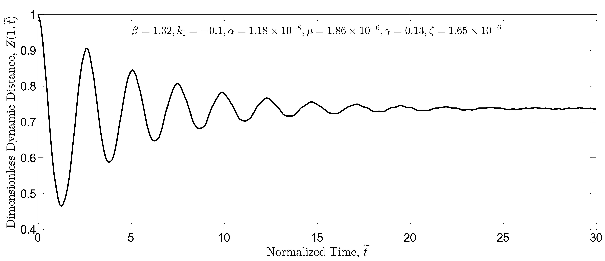 (a)
</p>
<p align="center">
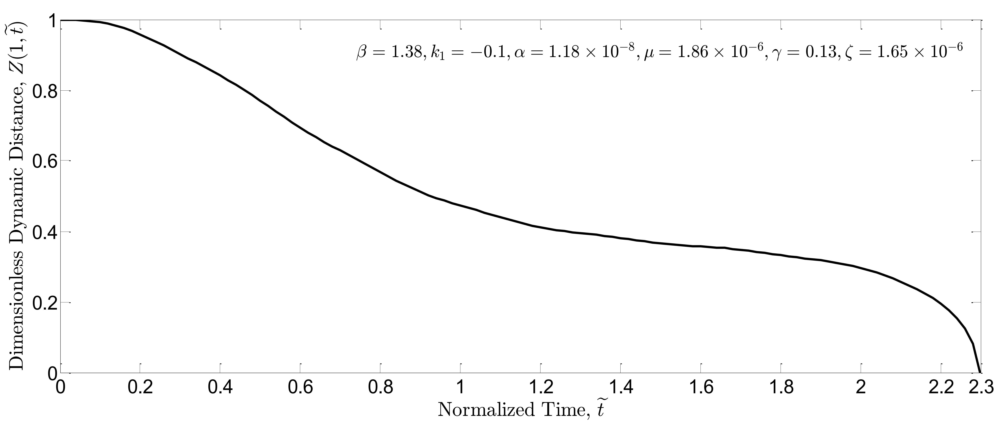 (b)
</p>

#### Fig. 5. Dimensionless dynamic distance $Z(1,\tilde{t})$ vs. time plotted for closed-loop system: a) $\beta=1.32$ and b) $\beta=1.38$.

As seen in these figures, the dynamic pull-in instability of open-loop and closed-loop systems occurs for $\beta\ge 1.32$ and $\beta\ge 1.38$, respectively. Thus, it can be concluded that the proposed boundary feedback control law can postpone the dynamic pull-in instability. In addition, the dynamic pull-in threshold can be raised further by increasing the control gain. For instance, as shown in Fig. 6(a) and 6(b), the absolute value of $k_1$ is increased tenfold which leads to stability of closed-loop system for $\beta=1.5$. This shows that an increase in the controller gain $k_1$ can certainly decrease the beam fluctuations and therefore raise the pull-in threshold.

<p align="center">
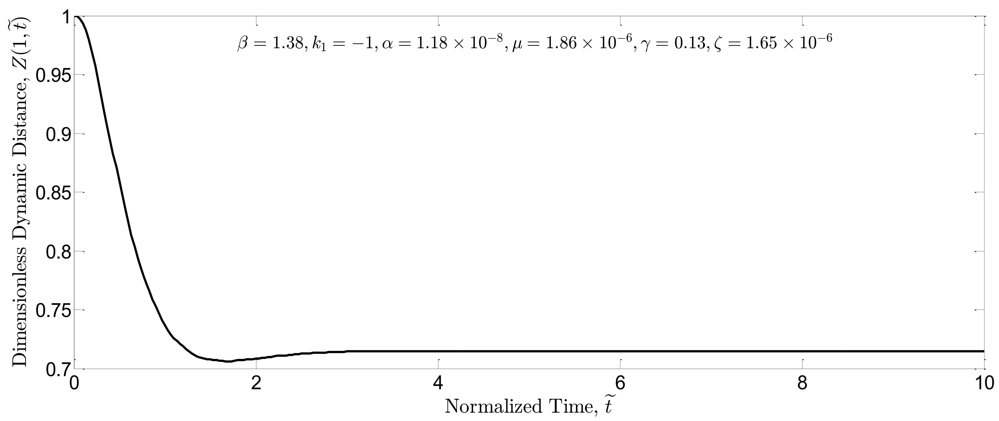 (a)
</p>
<p align="center">
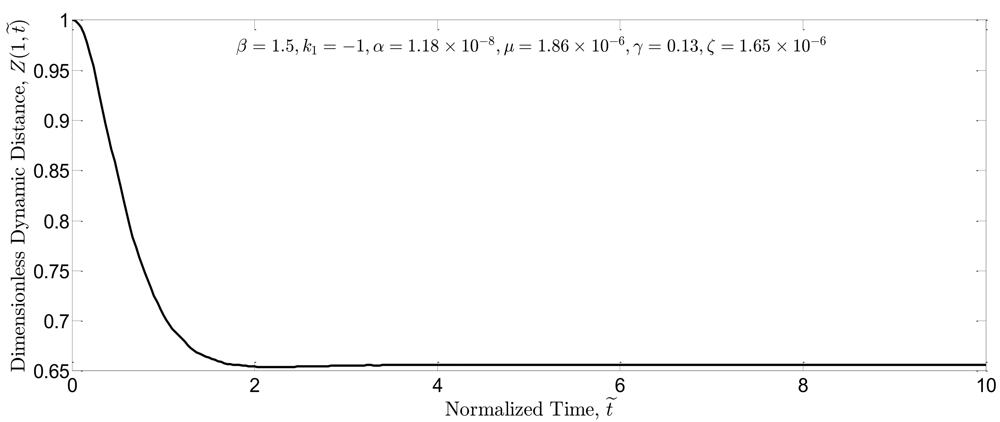 (b)
</p>

#### Fig. 6. Dimensionless dynamic distance  $Z(1,\tilde{t})$ vs. time plotted for closed-loop system: a) $\beta=1.38$  and b) $\beta=1.5$.

The controller performance is also assessed for a large region of the parameters space. In the absence of the controller, the beam oscillation is simulated for various coefficients of $\beta$ and $\alpha$ in Fig. 7(a). In this figure, the vertical axis indicates the mean distance between free end of the beam and the ground after reaching a stable oscillation (i.e. $Z_m = \min (Z(1,\tilde{t}\ge t_\infty))/2 +  \max (Z(1,\tilde{t}\ge t_\infty))/2$). In the simulations, the beam oscillations become stable after a time about $\tilde{t}_\infty = 5$. The dashed line in Fig. 7(a) shows the dynamic pull-in instability limit; for the parameters pointed below the dashed line, the pull-in instability in the system response is inevitable. In the presence of the controller, the simulations are repeated in Fig. 7(b) in which the vertical axis represents the distance between free end of the beam and the ground when the beam comes to rest (i.e. $Z_\infty= Z(1,t_\infty)$). For the controller gain $k_1=-1$, the steady state is reached before $\tilde{t}_\infty=10$. As seen in this figure, the safe region for the force coefficients is extended and thus the stability is guaranteed for a large region of the parameters space.


<p align="center">
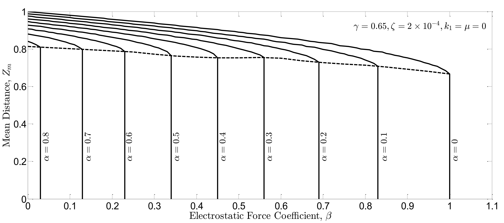 (a)
</p>

#### Fig. 7(a). Mean distance $Z_m$ between the free end of the beam and the ground for stable oscillations in open-loop system vs. nonlinear force coefficients $\beta$ and $\alpha$. 


<p align="center">
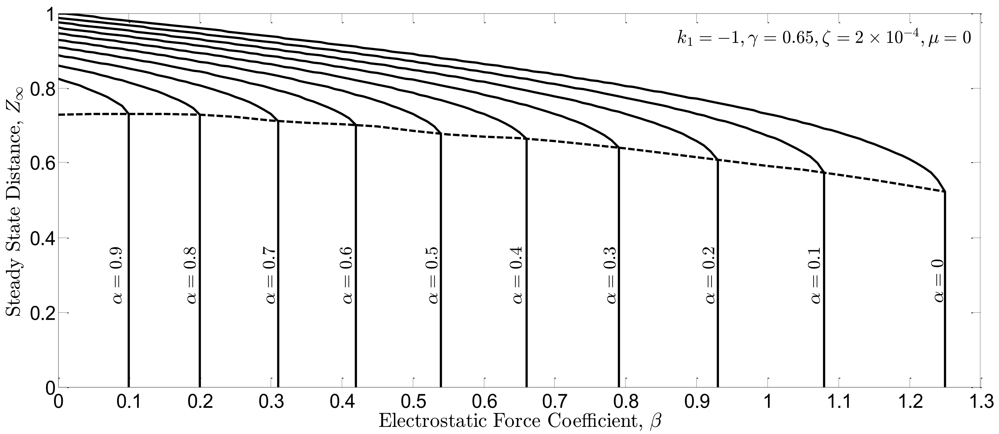 (b)
</p>

#### Fig. 7(b). Steady state distance $Z_\infty$ between the free end of the beam and the ground in closed-loop system vs. nonlinear force coefficients $\beta$ and $\alpha$.


The same procedure is followed for the nonlinear force coefficients $\mi$ and  $\gamma$ in Fig. 8(a), 8(b), 9(a), and Fig. 9(b). Similarly, the controller can suppress the beam vibrations and raise the pull-in threshold as well. In addition, when the dynamic pull-in instability in the open-loop system occurs, the mean distance $Z_m$ lies in the range of $[0.6-0.8]$. On the other hand, when the dynamic pull-in instability in the closed-loop system occurs, the steady state distance $Z_\infty$  lies in the range of $[0.5-0.7]$. This indicates that the controller can also extend the travel range of the M/NEMS devices beyond the well-known pull-in limits. In some tuning applications, a large stable travel range is extremely useful.

<p align="center">
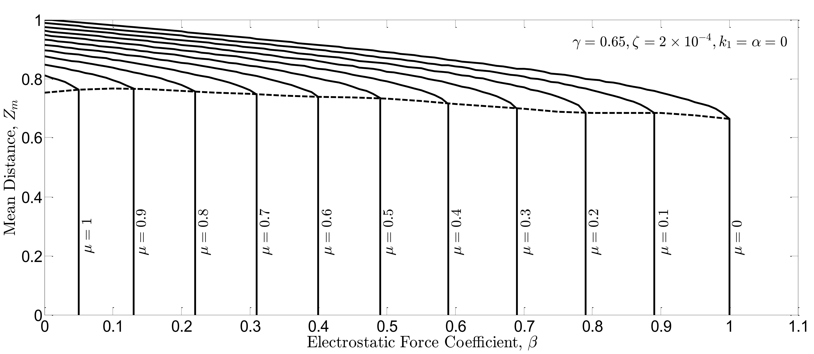 (a)
</p>

#### Fig. 8(a). Mean distance $Z_m$  between the free end of the beam and the ground for stable oscillations in open-loop system vs. nonlinear force coefficients $\beta$ and $\mu$. 

<p align="center">
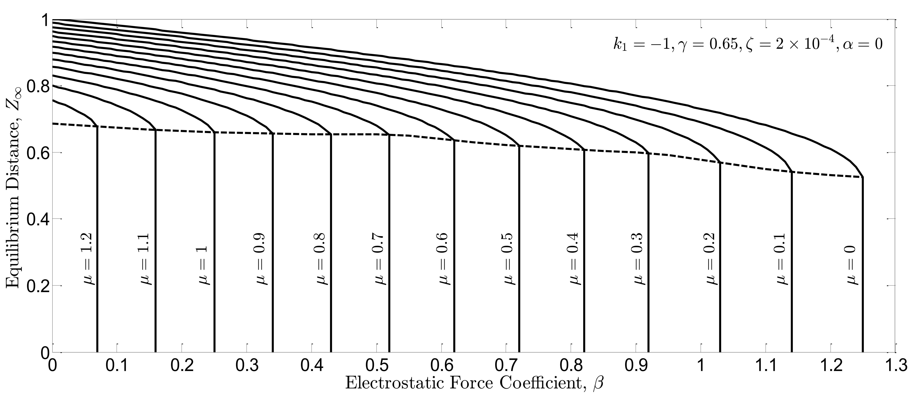 (b)
</p>

#### Fig. 8(b). Steady state distance $Z_\infty$ between the free end of the beam and the ground in closed-loop system vs. nonlinear force coefficients $\beta$ and $\mu$.


<p align="center">
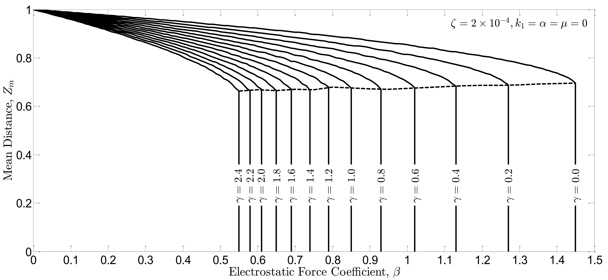 (a)
</p>

#### Fig. 9(a). Mean distance $Z_m$ between the free end of the beam and the ground for stable oscillations in open-loop system vs. nonlinear force coefficients $\beta$ and $\gamma$.


<p align="center">
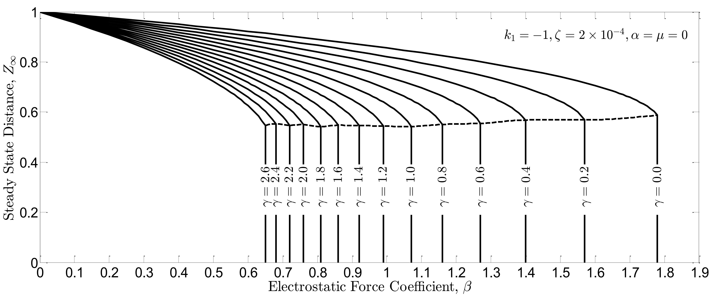 (b)
</p>

#### Fig. 9(b). Steady state distance $Z_\infty$ between the free end of the beam and the ground in closed-loop system vs. nonlinear force coefficients $\beta$ and $\gamma$.


In all of the simulations, Casimir and van der Waals forces have adverse effect on the performance of M/NEMS devices. They lower the pull-in threshold and narrow the travel range. On the other hand, the fringing filed effect extends the travel range, though decreases the pull-in voltage as well.
The effect of the new material length scales is also studied in Fig. 10(a) and Fig. 10(b). In these figures, the coefficient of the non-classical terms in the governing equation (i.e. the coefficient $\zeta$) is changed from $10^{-5}$ to $10^{-2}$. Simulations show that the more beam model deviates from the classical model the more pull-in threshold is raised. Moreover, similar to previous simulations, in the presence of controller, the travel range is wider and the pull-in voltage is higher.

<p align="center">
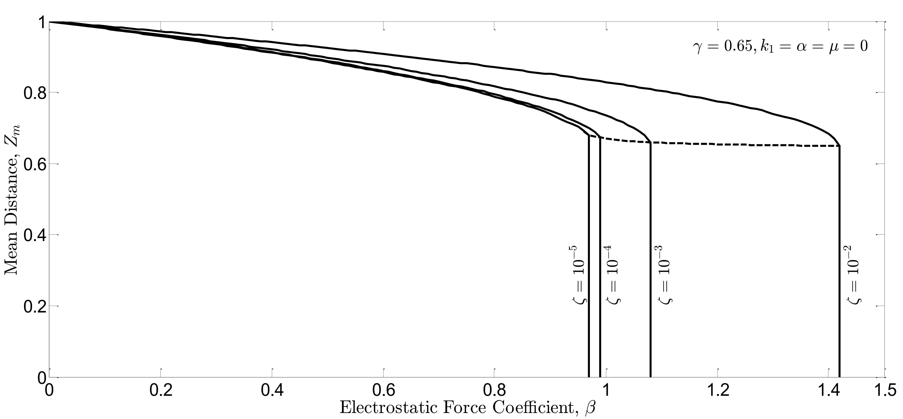 (a)
</p>

#### Fig. 10(a). Mean distance  $Z_m$ between the free end of the beam and the ground for stable oscillations in open-loop system vs. nonlinear force coefficients $\beta$ and $\zeta$.

<p align="center">
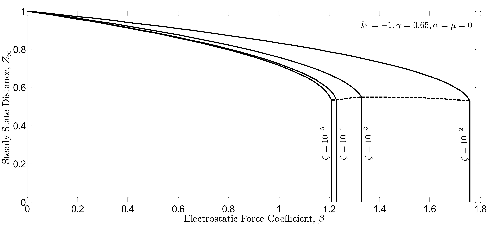 (b)
</p>

#### Fig. 10(b). Steady state distance $Z_\infty$ between the free end of the beam and the ground in closed-loop system vs. nonlinear force coefficients $\beta$ and $\zeta$.


## References
[1] **M. S. Edalatzadeh** and A. Alasty, “Boundary Exponential Stabilization of Non-classical Micro/Nano Beams Subjected to Nonlinear Distributed Forces,” Applied Mathematical Modelling, vol. 40, no. 3, pp. 2223–2241, 2016.

[2] **M. S. Edalatzadeh**, A. Alasty, and R. Vatankhah, “Admissibility and Exact Observability of Observation Operators for Micro-Beam Model: Time and Frequency Domain Approaches,” IEEE Transaction on Automatic Control, vol. 62, no. 12, pp. 6438–6444, 2017.

[3] **M. S. Edalatzadeh**, R. Vatankhah, and A. Alasty, “Suppression of Dynamic Pull-in Instability in Electrostatically Actuated Strain Gradient Beams,” in Second RSI/ISM International Conference on Robotics and Mechatronics (ICRoM), 2014, pp. 155–160.

[4] D. Lam, F. Yang, A. Chong, J. Wang, P. Tong, Experiments and theory in strain gradient elasticity, Journal of the Mechanics and Physics of Solids, 51 (2003) 1477-1508.

[5] R.F. Curtain, H. Zwart, An Introduction to Infinite-Dimensional Linear Systems Theory, Springer, 1995.

[6] I.M. Gelfand, I.M. Gelfand, S.V. Fomin, R.A. Silverman, Calculus of Variations, Dover Publications, 2000.

[7] J.N. Reddy, An Introduction to Nonlinear Finite Element Analysis, Oxford University Press, New York, 2004.

[8] L.V. Kantorovich, V.I. Krylov, Approximate Methods of Higher Analysis, P. Noordhoff, 1958.

