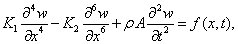
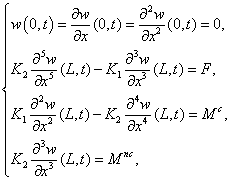
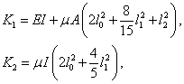
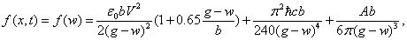
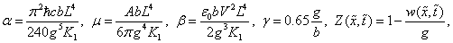
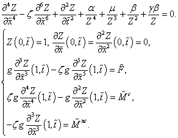
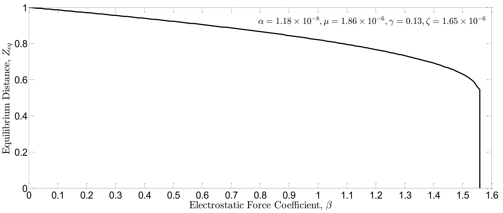
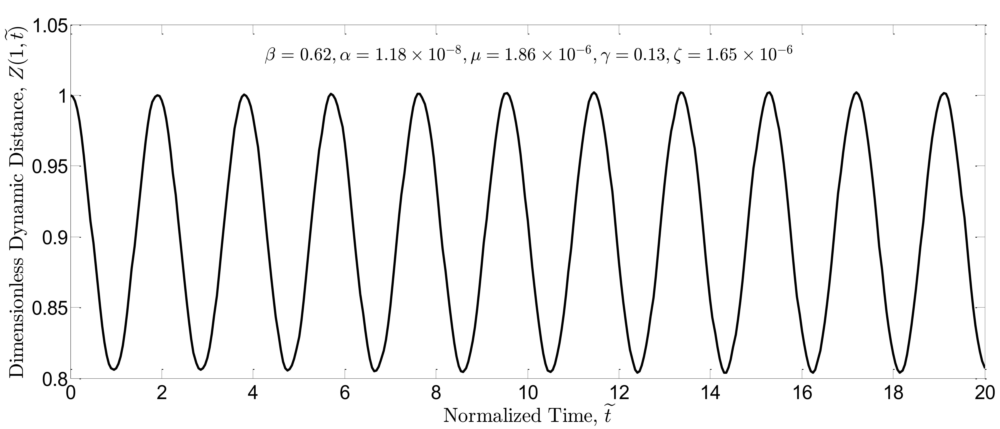
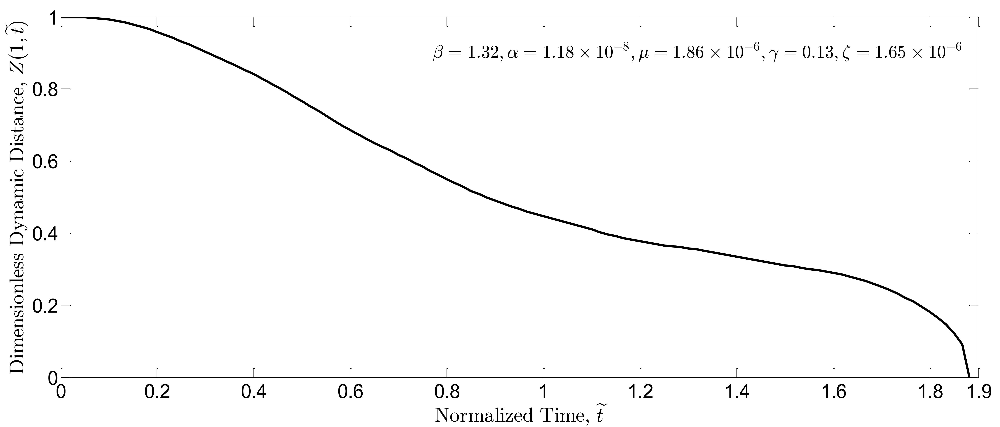

# Boundary Controller and Estimator Design for Micro Beam Models

Based on the strain gradient elasticity theory by Lam et al., a new flexible micro beam model can be derived by making Euler-Bernoulli beam assumptions and by using Hamilton principle. Accordingly, the governing PDE of motion and corresponding boundary conditions (BSc) for a micro cantilever beam with uniform cross section $A$ and length $L$ become

where $x$ and $t$ denote the independent spatial and time variables, respectively; $\rho$ represents the beam density; $w$ indicates the lateral deflection; $f(x,t)$ denotes distributed external transverse force; $F$, $M^c$ and $M^{nc}$ are control inputs and refer to boundary force, moment and non-classical moment exerted at the tip of beam, respectively.  In addition,

where $I$ is the area moment of inertia of the beam cross-section; $\mu$ and $E$ are the shear and Young’s modulus, respectively; $\ell_0$,  $\ell_1$, and $\ell_2$ are additional material constants that appear in the constitutive relations between higher order stress tensors and strain tensors in strain gradient elasticity theory. By setting $\ell_0$, $\ell_1$, and $\ell_2$ to zero, the classical Euler-Bernoulli beam model can be obtained straightforwardly. 

### External Distributed Forces
A schematic of the cantilever beam used in M/NEMS devices is shown in the Fig. 1. The cantilever has length $L$, uniform cross section $A$, and width $b$; it is separated by a gap with length $g$ from the underneath substrate. The substrate exposes the beam to nonlinear distributed forces arising from electrical potential difference and intermolecular interactions between the beam and the underneath substrate.
 

#### Fig. 1. Schematic of a cantilever beam based M/NEMS device: (a) Cantilever beam, (b) Dielectric spacer, and (c) Substrate.

The intermolecular forces that play a crucial role in micron and submicron scale are the van der Waals and the Casimir force, which have different range of application. The Casimir force is effective in the micro-scale ranges whereas the van der Waals force is effective in nano-scale ranges. To investigate a general case, we omit consideration of the transition regime and formulate the distributed external transverse forces more generally as follows:
  

in which the first right-hand side term gives the value of the electrostatic force with first order fringing field correction; the next one gives the value of the Casimir force; the last one is the usual expression for the van der Waals force. Furthermore, $\hbar = 1.055\times 10^{-43}Js$ is Plank constant divided by $2\pi$; $c=2.2998\times 10^8 m/s$ is speed of light; $\epsilon_0=8.854\times 10^{-12}C^2/Nm^2$ is the permittivity of vacuum;  $A$ is the Hamaker constant with values in the range of $[0.4,4]\times 10^{-19}J$ and $V$ denotes the electrical potential difference between the beam and the underneath plate. Utilizing the strain gradient Euler-Bernoulli beam model and defining the following dimensionless variables:

the PDE and corresponding BCs governing the micro- or nano- cantilever beam used in M/NEMS devices are
 

##	Simulation Results
In this section, the effectiveness of the proposed controller in suppressing the nonlinear forced vibrations and dynamic pull-in instability of the system is demonstrated. In this regard, the nonlinear dimensionless PDE and corresponding BCs. in (2.9) under the boundary feedback control law (3.9) are numerically solved using Kantorovich method and iterative Newton-Raphson algorithm. Nonlinear terms in the governing PDE arise from external distributed forces, namely Casimir, van der Waals forces, and electrostatic force with first order fringing field correction; coefficients $\alpha$, $\mu$, $\beta$ and $\gamma$ are associated with these forces, respectively.

The geometrical and mechanical properties of the strain gradient micro-beam considered for computer simulations are specified in Table 1. The micro-beam is considered to be made of epoxy; the mechanical properties of the epoxy micro-beams are measured by Lam et al.

#### Table 1. The geometrical and mechanical properties of the epoxy micro-beam.

|Symbol	|Quantity	|Value|
|:------:|:---------:|:------:|
|$E$	|Modulus of Elasticity|	1.44 Gpa|
|$\nu$	|Poisson's Ratio|	0.38|
|$\mu$|	Density	|1220 Kg/m3|
|$\ell_0= \ell_1=\ell_2$|	Material Length Scale|	17.6 $µm$|
|$b$	|Width	|20 $µm$|
|$t$	|Thickness|	2 $µm$|
|$L$	|Length	|400 $µm$|
|$g$	|Gap Length|	4 $µm$|

According to Table 1, the coefficients corresponding to the sixth order derivative of the beam deflection, fringing fields correction term, Casimir and van der Waals forces are $\zeta=1.65\time 10^{-6}$, $\gamma = 0.13$, $\alpha = 2.18\times 10^{-8}$, and $\mu = 1.86\times 10^{-6}$, respectively. In addition, for an electric potential difference $V=20volt$, the electrostatic force coefficient is $\beta=0.63$. In this paper, all of these coefficients are also changed within specific ranges and then the static and dynamic behavior of M/NEMS devices in the absence and presence of the controller are observed. To this end, the spatial domain is discretized; the micro-beam length is divided into 10 beam elements with equal lengths. In addition, in each time step, 20 iterations are considered in the Newton-Raphson iteration method for converging to an exact solution. It is well-known that when the amount of nonlinear force coefficients become greater than specified limits, the cantilever beam becomes unstable and impulsively collapses or pulls-in onto the ground plane. Thus, in order to investigate the nonlinear vibration isolation of the closed-loop system, the threshold value of the nonlinear force coefficients should be calculated at the outset. For this purpose, the static solution   is found by solving Eq. (3.5) numerically for various nonlinear force coefficients. The result of the calculations is plotted in Fig. 2 in which the vertical axis indicates the equilibrium distance at the tip of beam (i.e $Z_{eq}= u(1)$) and the sudden drop shows the pull-in instability. In this figure, one of the force coefficients is changed while the rest are set to zero, except for the pair of  $\beta$ and $\gamma$.

 

#### Fig. 2. Equilibrium distance between the free end of the beam and the ground $Z_{eq}=u(1)$ vs. various coefficients of the nonlinear forces.

Next, the effect of the proposed controller is studied on the dynamic pull-in threshold of the nonlinear system. In order to simulate the dynamic pull-in instability, the beam is considered to be at rest and an electric potential difference is suddenly applied to the device. The open-loop and closed-loop system response are then simulated for various values of electrostatic force coefficient $\beta$ while the other force coefficients are assumed constant.

As a case in point, considering the practical values for $\zeta$, $\gamma$, $\alpha$, and $\mu$ based on Table 1, the static solution $u(x)$ is found for various coefficient $\beta$. The results are shown in the Fig. 3 in which the maximum value for electrostatic force coefficient is at $\beta = 1.56$. In the dynamic system simulations, we should not cross this threshold.

 

#### Fig. 3. Equilibrium distance between the free end of the beam and the ground $Z_{eq}=u(1)$ vs. $\beta$.

Running the dynamic simulations, Fig. 4(a) and 4(b) indicate dimensionless dynamic distance $Z(1,\tilde{t})$ for $\beta$ and $\beta=1.32$ in the simulation of open-loop system, respectively.

 

 

Fig. 4. Dimensionless dynamic distance   vs. time plotted for open-loop system: a)   and b)  .
